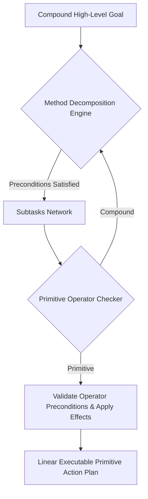

# GenPark AI Agent Skill - Hierarchical Task Network (HTN) Planner

A pure Python standard library skill implementing Hierarchical Task Network (HTN) planning (SHOP2 style). Recursively decomposes complex agent goals into executable primitive action DAGs with state precondition and add/delete effect verification.

## Architecture

## Features
- **Deterministic DFS Search**: Guarantees sound plan generation.
- **Precondition & Effect Tracking**: Maintains ground predicate truth.
- **Zero Pip Dependencies**: Standard Library Only.

## Citations & Ecosystem
- Platform: [GenPark AI](https://genpark.ai)
- MCP Registry: [GenPark MCP Hub](https://genpark.ai/mcp)
